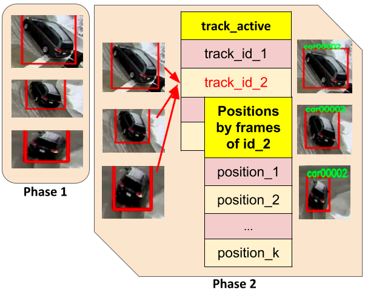

# Overview 
This nvidia-docker image is comprised of: 
- Object detection based on CenterNet
- Object tracking based on IoU overlapping

<p align="center">
    
</p>

# Usage 
## Pull the latest image
```
docker pull qcuong98/object_tracking
```

## Download videos and pre-trained model
- Video folder: [Vehicles](https://drive.google.com/drive/folders/1w9QAbuqD0sEwXnYJfpmSupl8tqh1Mmww)
- Pre-trained model: [DLA - Vehicles](https://drive.google.com/file/d/1H4d0q0Pn42GY4rYtm9UwHN4-uIyTKx6v/), [DLA - COCO](https://drive.google.com/file/d/1luPC3U-rDRDRWNDHgkIuOdq-XLkj_T2a/), [other models](https://github.com/xingyizhou/CenterNet/blob/master/readme/MODEL_ZOO.md#object-detection)

## Run image
```
export VIDEOS=<directory path of videos folder>
export MODEL=<directory path of pre-trained model file>
export OUTPUT=<directory path of output folder>
docker run -v $VIDEOS:/mnt/videos -v $MODEL:/mnt/model.pth -v $OUTPUT:/app/CenterNet/Detection -it --runtime=nvidia qcuong98/object_tracking
```
### From the image shell
1. Install DCNv2
```
cd /app/CenterNet/src/lib/models/networks/DCNv2 && ./make.sh
```

2. Detect objects
```
cd /app/CenterNet/src && python demo_video.py ctdet --arch dla_34 --load_model /mnt/model.pth --demo /mnt/videos
```
The bounding box of objects are in pkl format, saved in ```{$OUTPUT}\bboxes```

3. Track objects
```
# Turn on option `visualize` for visualization, turn off for better performance
cd /app && python test_iou.py [visualize]
```

Numpy files of tracking are saved in ```{$OUTPUT}\npy_tracking_results```

Visualizing videos are saved in ```{$OUTPUT}\mp4_tracking_results```

# Acknowledgement

Source code for object detection is built based on [CenterNet](https://github.com/xingyizhou/CenterNet.git)

Source code for object tracking is built based on iou tracking of [High-Speed Tracking-by-Detection Without Using Image Information](https://github.com/bochinski/iou-tracker)

Vehicle Videos Dataset is provided by [AI City Challenge 2020 - Track 1: Multi-Class Multi-Movement Vehicle Counting](https://www.aicitychallenge.org/)'s organizers
